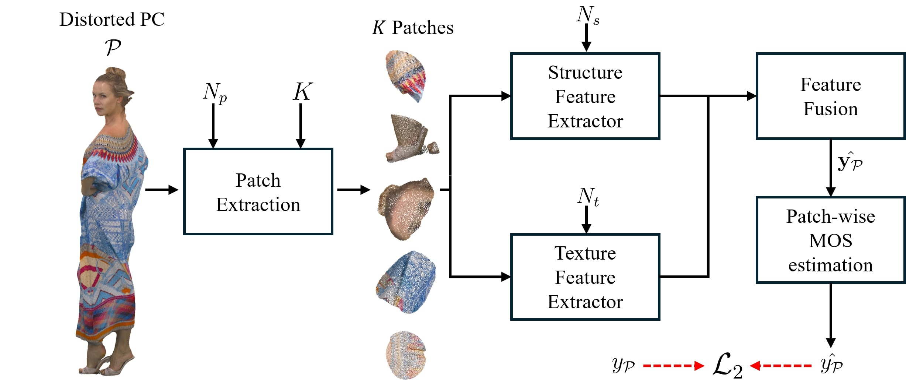
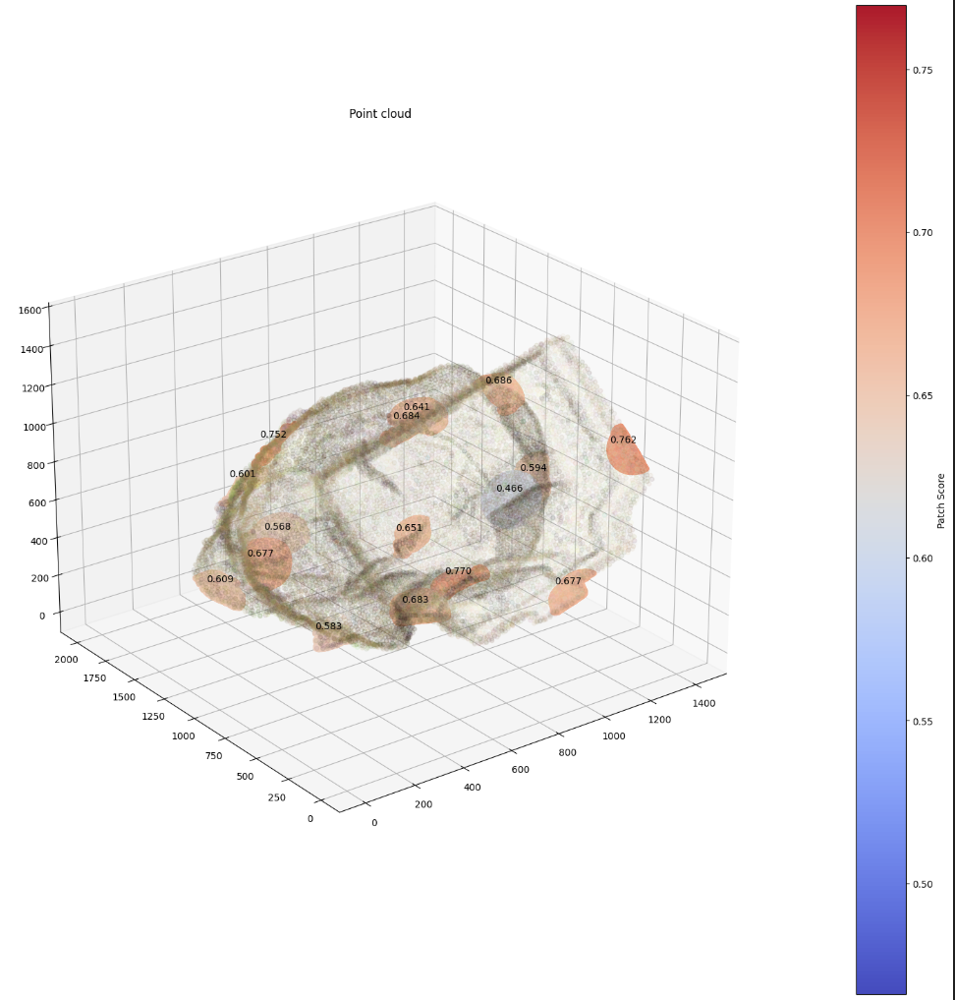

# PST-PCQA



Official repository to the article "Low-Complexity Patch-based No-Reference Point Cloud Quality Metric exploiting Weighted Structure and Texture Features" accepted for publication in IEEE Transactions on Broadcasting.

# Instructions
The structure of the project should be like the following:
- 📁 best_models/WPC
    - 🧠 PST_PCQAModule_K_16.ckpt (model trained on WPC with 16 patches)
    - 🧠 PST_PCQAModule_K_8.ckpt (model trained on WPC with 16 patches)
- 📁 data (you have to download the datasets)
    - 📁 WPC
      - 📁 distorted
      - 🔢 mos.xls
    - 📁 SIAT-PCQD
      - 📁 distorted
      - 🔢 DMOS.xlsx
    - 📁 SJTU-PCQA
      - 📁 distorted
      - 🔢 MOS.xlsx
- 📄 environment.yml (Conda environment to import)
- 📄 model.py (proposed approach)
- 📄 patch_extraction.py (To extract patches before training)
- 📄 util.py 
- 📓 training_val_test_{WPC,SJTU,SIAT}.py (code for training, validating, and testing PST-PCQA on WPC, SIAT, and SJTU datasets)
  

First, run patch_extraction.py to create, using WPC dataset as an example, 📁 data/WPC/distorted_npz_K folder containing the K patches for each point cloud.
Then, it is possible to run the trainin_val_test_WPC.py script, targeting the created folder containing the patches.

# Inference

The repository contains 📄 example_inference.ipynb notebook to provide a minimal example on how to extract patches and perform inference on the fly. In addition, a visualization of the patch scores is also available (Note: Visualization is computationally expensive). 
The model takes approximately 50 ms to perform inference on a single NVIDIA RTX 4070.




## Authors

Michael Neri*, Federica Battisti°

*Faculty of Information Technology and Communication Sciences, Tampere University, Tampere, Finland

°Department of Information Engineering, University of Padova, Padua, Italy 

## Reference

If you use part of this code, please cite the following article

```
@ARTICLE{Neri_TBC_2025,
  author={Neri, M. and Battisti, F.},
  journal={IEEE Transactions on Broadcasting}, 
  title={{Low-Complexity Patch-based No-Reference Point Cloud Quality Metric exploiting Weighted Structure and Texture Features}}, 
  year={2025},
  volume={},
  number={},
  pages={},
  doi={}
  }
```
